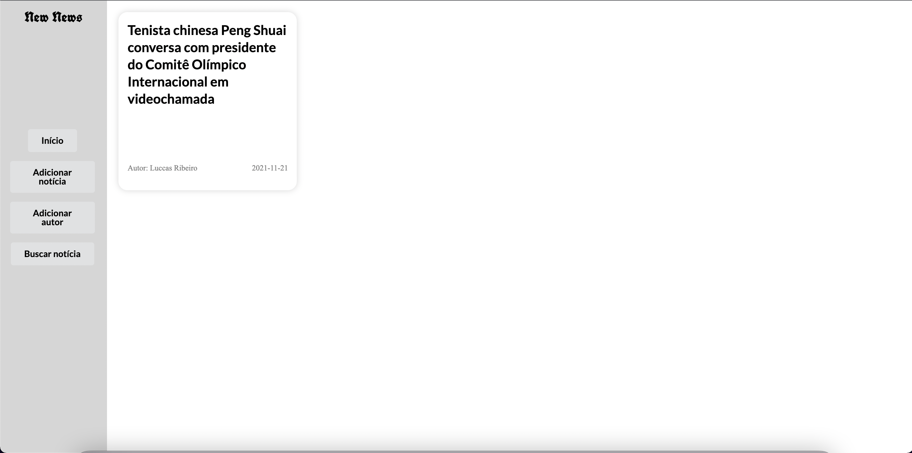
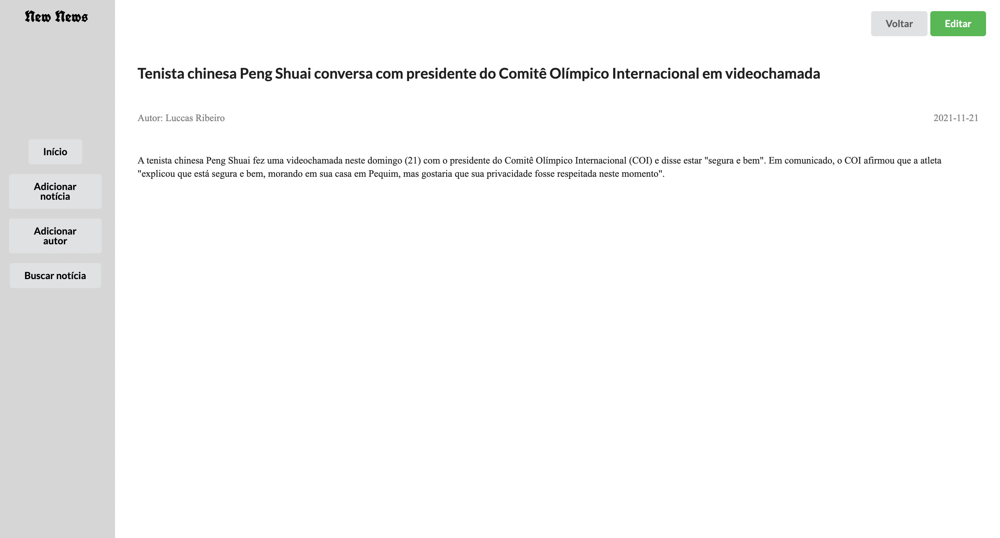
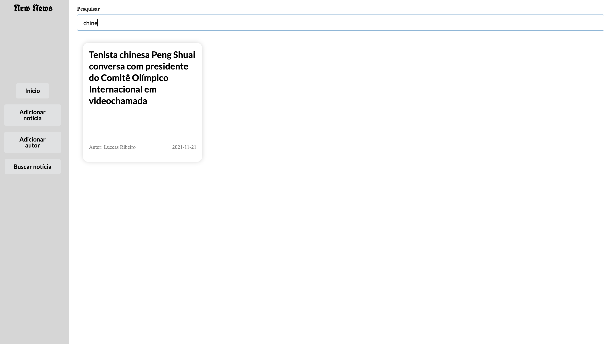

<p align="center">
New News
</p>


<h1 align="center">
    
</h1>

<br>

## 🧪 Tecnologias

Esse projeto foi desenvolvido com as seguintes tecnologias:

- [React](https://reactjs.org)
- [TypeScript](https://www.typescriptlang.org/)
- [Json-server](https://www.npmjs.com/package/json-server)

## 🚀 Como executar

Clone o projeto e acesse a pasta do mesmo.

Para iniciá-lo, siga os passos abaixo:
```bash
# Instalar as dependências
$ yarn
# Iniciar o Json-server
$ yarn server
# Iniciar o projeto
$ yarn start
```
O mesmo estará disponível no seu browser pelo endereço http://localhost:3000

## 💻 Projeto

New News é um painel onde você poderá visualizar, adicionar, editar e excluir notícias.

Clicando em um dos Cards, a page da notícia será aberta:
<h1 align="center">
    
</h1>

Na page de pesquisa você poderá pesquisar qualquer texto, e as notícias relaciondas vão aparecer:
<h1 align="center">
    
</h1>


## 🔖 Layout

O Layout foi criado por mim no decorrer do desenvolvimento do projeto, não sou nenhum especialista em UX UI, mas tentei dar o meu melhor 😅
